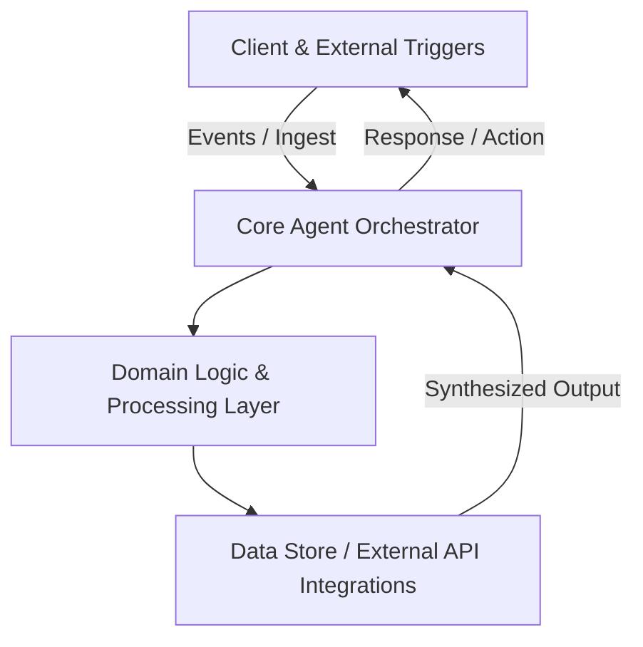

<div align="center">

# 🚀 Palvia Multiagent Assistant

**Autonomous multi-agent personal assistant for iOS with persistent SwiftData memory, subagent orchestration, and tool execution.**

    
[](LICENSE)

<p align="center">
  Autonomous multi-agent personal assistant for iOS with persistent SwiftData memory, subagent orchestration, and tool execution.
</p>

</div>

---

## 🌟 Key Highlights & Architectural Features

- **⚡ Modern Architecture**: Engineered using Swift, SwiftUI, SwiftData, Tool Calling.
- **🎯 Core Domain Capability**: Autonomous multi-agent personal assistant for iOS with persistent SwiftData memory, subagent orchestration, and tool execution.
- **🔒 Production-Ready & Modular**: Strict separation of concerns, robust error handling, and high-performance throughput.
- **📈 Scalable & Maintainable**: Built following modern enterprise standards with full CI/CD verification.

---

## 🏗️ System Architecture & Workflow



| Layer | Primary Technologies | Role |
| :--- | :--- | :--- |
| **Frontend / Interface** | Swift | Interactive interface, state management, and real-time events |
| **Agent / Processing Engine** | SwiftUI | Core autonomous reasoning, tool dispatching, and orchestration |
| **Data & Services** | SwiftData | Persistence, vector indexing, caching, and external webhooks |

---

## 🚀 Quick Start Guide

### 1. Clone & Setup
```bash
git clone https://github.com/the-forgotten-polymath/palvia-multiagent-assistant.git
cd palvia-multiagent-assistant
```

### 2. Launch
Refer to repository package specifications to run locally.

---

## 📄 License

This project is licensed under the **MIT License**.
